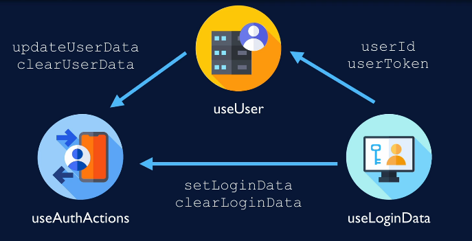

# Auth hooks of Lazy Days

The authentication hooks have already been written in the Lazy Days app.

## Auth hooks

**useLoginData**

returns AuthContext value:

{ userId, userToken, clearLoginData, setLoginData }

**useAuthActions**

returns auth methods

{ signin, signout, signup }

**useUser**

returns server user data

{ user, updateUserData, clearUserDta }

## Hooks using Hooks

- `useUser` needs to know which user is logged in by `useLoginData`, then it can fetch user data from the server.

- `useAuthActions` needs to update or clear user data from both cache (`useUse`) and context (`useLoginData`).

## Why store user ID and token twice (auth context and query cache)?

Why just not store them in the cache, like before?

**Reason I**

`useUser` query requires user ID to fetch user data. If we store user ID in the cache also, it'll become messy and circular.

**Reason II**

Logged-in user is not server state. It's a client state.

So, It make sense to store separately on client-side.
