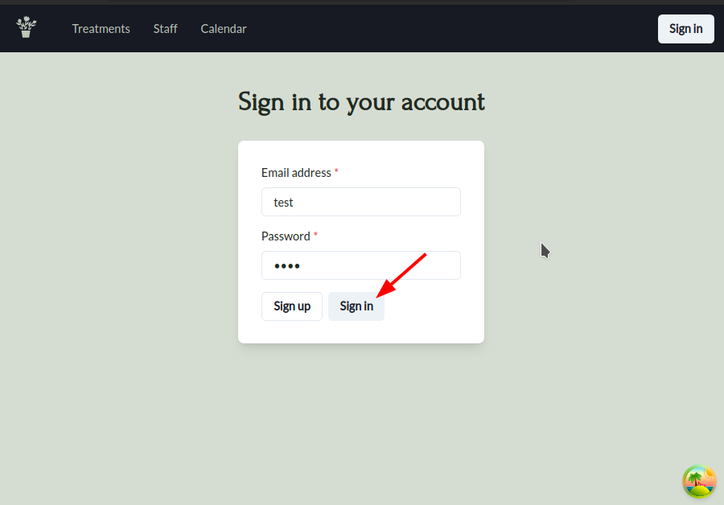

# Query user object when log in




So, we want to fetch user data in `useUser` hook with the user id and token from `useLoginData` hook.

```ts
// src/components/user/hooks/useUser.ts 

import { AxiosResponse } from "axios";

import type { User } from "@shared/types";

import { useLoginData } from "@/auth/AuthContext";
import { axiosInstance, getJWTHeader } from "@/axiosInstance";
import { queryKeys } from "@/react-query/constants";
import { useQuery } from "@tanstack/react-query";

async function getUser(userId: number, userToken: string) {
  const { data }: AxiosResponse<{ user: User }> = await axiosInstance.get(
    `/user/${userId}`,
    {
      headers: getJWTHeader(userToken),
      //       ^^^^^^^^^^^^ add `Bearer `
    }
  );

  return data.user;
}

export function useUser() {
  const { userId, userToken } = useLoginData();  // get user id and token from auth context

  // query user object from server
  const { data: user } = useQuery({
    queryKey: [queryKeys.user, userId, userToken],
    queryFn: () => getUser(userId, userToken),
    staleTime: Infinity,
    //         ^^^^^^^^ so it prevent any re-fetching chance
  })

  function updateUser(newUser: User): void {
    // TODO: update the user in the query cache
  }

  function clearUser() {
    // TODO: reset user to null in query cache
  }

  return { user, updateUser, clearUser };
  //       ^^^^ component already use this user object
}

```

Because `useUser` relies on `useLoginData`, it must be called after `userId` has been set, or it shouldn't do any query, we can use `enabled` option of `useQuery` hook to prevent unnecessary queries.

```tsx
import { AxiosResponse } from "axios";

import type { User } from "@shared/types";

import { useLoginData } from "@/auth/AuthContext";
import { axiosInstance, getJWTHeader } from "@/axiosInstance";
import { queryKeys } from "@/react-query/constants";
import { useQuery } from "@tanstack/react-query";

async function getUser(userId: number, userToken: string) {
  const { data }: AxiosResponse<{ user: User }> = await axiosInstance.get(
    `/user/${userId}`,
    {
      headers: getJWTHeader(userToken),
    }
  );

  return data.user;
}

export function useUser() {
  const { userId, userToken } = useLoginData();

  const { data: user } = useQuery({
    enabled: !!userId,  // prevent query when userId is not set yet
    queryKey: generateUserkey
    queryFn: () => getUser(userId, userToken),
    staleTime: Infinity,
  })

  function updateUser(newUser: User): void {
    // TODO: update the user in the query cache
  }

  function clearUser() {
    // TODO: reset user to null in query cache
  }

  return { user, updateUser, clearUser };
}

```

We can further optimize the `useUser` hook by create a generator for its query key. This way, we can prevent the mistake of passing wrong order of arguments to the query key.


```ts
// src/react-query/key-factories.ts  (new file)

import { queryKeys } from "./constants"

export const generateUserKey = (userId: number, userToken: string) => {
  return [queryKeys.user, userId, userToken];
}
```

```ts
// src/components/user/hooks/useUser.ts

import { AxiosResponse } from "axios";

import type { User } from "@shared/types";

import { axiosInstance, getJWTHeader } from "../../../axiosInstance";

import { useLoginData } from "@/auth/AuthContext";
import { useQuery } from "@tanstack/react-query";
import { generateUserKey } from "@/react-query/key-factories";  // import the key generator

async function getUser(userId: number, userToken: string) {
  const { data }: AxiosResponse<{ user: User }> = await axiosInstance.get(
    `/user/${userId}`,
    {
      headers: getJWTHeader(userToken),
    }
  );

  return data.user;
}

export function useUser() {
  const { userId, userToken } = useLoginData();
  const { data: user } = useQuery({
    enabled: !!userId,
    queryKey: generateUserKey(userId, userToken),
    //        ^^^^^^^^^^^^^^^^^^^^^^^^^^^^^^^^^^ generate key by key generator, which prevent the mistake of passing wrong order of arguments
       
    queryFn: () => getUser(userId, userToken),
    staleTime: Infinity,
  })

  // meant to be called from useAuth
  function updateUser(newUser: User): void {
    // TODO: update the user in the query cache
  }

  // meant to be called from useAuth
  function clearUser() {
    // TODO: reset user to null in query cache
  }

  return { user, updateUser, clearUser };
}

```

Now, when user logged in, the user data will be fetched from the server and stored in the query cache. The component can access the user data from the cache and display it as below:


> The most important thing this topic we learned is when one query depends on another query, we can use `enabled` option of `useQuery` hook to prevent unnecessary queries before dependent query is ready.
```tsx
