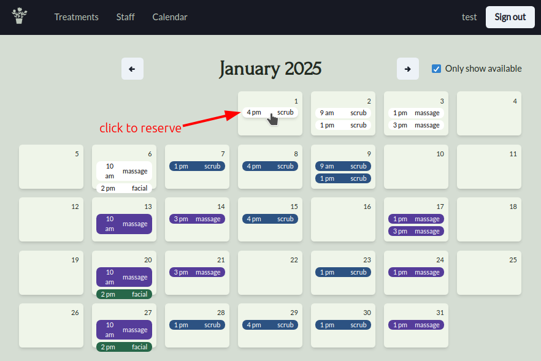
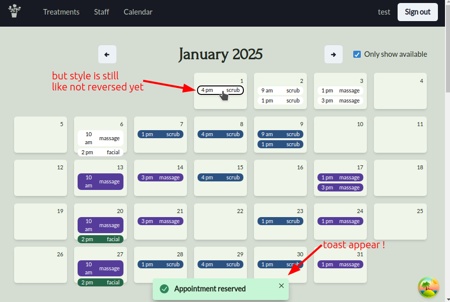

# useMutation for reserving a appointment


## Introduction to useMutation

* Very similar to useQuery!

### Differences

* No cache data
* No retries
* No refetch (because there's no cache)
* No `isLoading` vs `isFetching` (because there's no cache)
* Returns `mutate` function which actually runs the mutation
* `onMutate` callback (useful for optimistic queries!)

### Reference

* https://tanstack.com/query/latest/docs/react/reference/useMutation
* https://tanstack.com/query/latest/docs/react/guides/mutations


## Implementation

```ts
// src/components/appointments/hooks/useReserveAppointment.ts 

import { Appointment } from "@shared/types";

import { useLoginData } from "@/auth/AuthContext";
import { axiosInstance } from "@/axiosInstance";
import { useCustomToast } from "@/components/app/hooks/useCustomToast";
import { queryKeys } from "@/react-query/constants";
import { useMutation } from "@tanstack/react-query";

// for when we need functions for useMutation
async function setAppointmentUser(
  appointment: Appointment,
  userId: number | undefined,
): Promise<void> {
  if (!userId) return;
  const patchOp = appointment.userId ? 'replace' : 'add';
  const patchData = [{ op: patchOp, path: '/userId', value: userId }];
  await axiosInstance.patch(`/appointment/${appointment.id}`, {
    data: patchData,
  });
}

export function useReserveAppointment() {
  const { userId } = useLoginData();

  const toast = useCustomToast();

  const { mutate } = useMutation({
    mutationFn: (appointment: Appointment) =>
      //         ^^^^^^^^^^^^^^^^^^^^^^^^ argument passed to `mutate` will be passed to mutationFn
      //                                  so when components use `mutate`, they can pass the appointment to it
      setAppointmentUser(appointment, userId),
      //                              ^^^^^^ userId comes from useLoginData hook, not from the component

    // similar to onError in global error handling, but this is only for this mutation and success case
    onSuccess: () => {
      toast({ title: "Appointment reserved", status: "success" });
    }
  })

  return mutate;  // only return mutate because loading spinner and error handling already handled globally
}

```

## Testing





The appointment is reserved and the toast appears but the appointment style still remains the same. That's because the cache data of appointments is not updated. We'll fix that in the next article.
