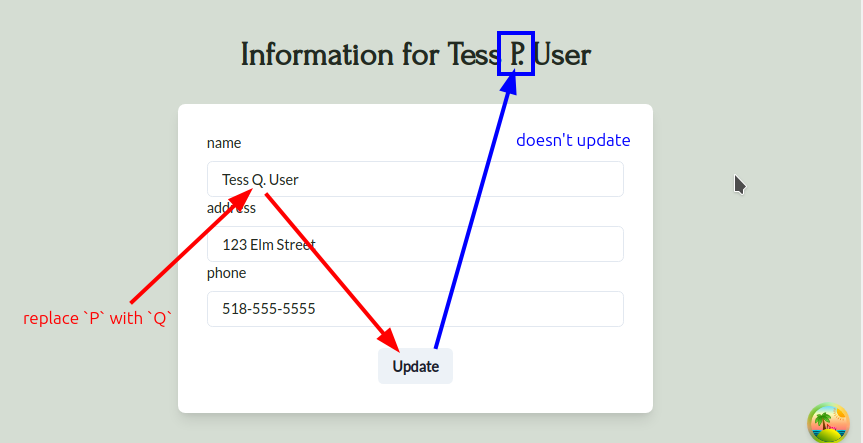

# Subtle Issue with User Updates in React Query

```tsx
~/D/g/s/t/u/b/client > cat src/components/user/UserProfile.tsx 
import {
  Box,
  Button,
  Flex,
  FormControl,
  FormLabel,
  Heading,
  Input,
  Stack,
} from "@chakra-ui/react";
import { Field, Form, Formik } from "formik";
import { useEffect } from "react";
import { useNavigate } from "react-router-dom";

import { usePatchUser } from "./hooks/usePatchUser";
import { useUser } from "./hooks/useUser";
import { UserAppointments } from "./UserAppointments";

import { useLoginData } from "@/auth/AuthContext";

export function UserProfile() {
  const { userId } = useLoginData();
  const { user } = useUser();   //  get user object from `useUser` hook which uses `useQuery` to fetch user data
  const patchUser = usePatchUser();
  const navigate = useNavigate();

  useEffect(() => {
    if (!userId) {
      navigate("/signin");
    }
  }, [userId, navigate]);

  const formElements = ["name", "address", "phone"];
  interface FormValues {
    name: string;
    address: string;
    phone: string;
  }

  return (
    <Flex minH="84vh" textAlign="center" justify="center">
      <Stack spacing={8} mx="auto" w="xl" py={12} px={6}>
        <UserAppointments />
        <Stack textAlign="center">
          <Heading>Information for {user?.name}</Heading>
                               {/* ^^^^^^^^^^^^ render `user.name` here */}
        </Stack>
        <Box rounded="lg" bg="white" boxShadow="lg" p={8}>
          <Formik
            enableReinitialize
            initialValues={{
              name: user?.name ?? "",
              address: user?.address ?? "",
              phone: user?.phone ?? "",
            }}
            onSubmit={(values: FormValues) => {
              patchUser({ ...user, ...values });
            }}
          >
            <Form>
              {formElements.map((element) => (
                <FormControl key={element} id={element}>
                  <FormLabel>{element}</FormLabel>
                  <Field name={element} as={Input} />
                </FormControl>
              ))}
              <Button mt={6} type="submit">
                Update
              </Button>
            </Form>
          </Formik>
        </Box>
      </Stack>
    </Flex>
  );
}

```



This is because we use the new user object from the mutation response to update the cache, creating a new cache with a different user token but it is not being used.

```ts
// src/components/user/hooks/useUser.ts

import { AxiosResponse } from "axios";

import type { User } from "@shared/types";

import { axiosInstance, getJWTHeader } from "../../../axiosInstance";

import { useLoginData } from "@/auth/AuthContext";
import { useQuery, useQueryClient } from "@tanstack/react-query";
import { generateUserKey } from "@/react-query/key-factories";
import { queryKeys } from "@/react-query/constants";

async function getUser(userId: number, userToken: string) {
  const { data }: AxiosResponse<{ user: User }> = await axiosInstance.get(
    `/user/${userId}`,
    {
      headers: getJWTHeader(userToken),
    }
  );

  return data.user;
}

export function useUser() {
  const { userId, userToken } = useLoginData();
  const queryClient = useQueryClient();

  const { data: user } = useQuery({
    enabled: !!userId,
    queryKey: generateUserKey(userId, userToken),
    queryFn: () => getUser(userId, userToken),
    staleTime: Infinity,
  })

  function updateUser(newUser: User): void {
    queryClient.setQueryData(generateUserKey(userId, userToken), newUser);
    //                                               ^^^^^^^^^ We use new user token here, it create new cache but not active it
  }

  function clearUser() {
    queryClient.removeQueries({
      queryKey: [queryKeys.user]
    });

    queryClient.removeQueries({
      queryKey: [queryKeys.appointments, queryKeys.user]
    });
  }

  return { user, updateUser, clearUser };
}
```

We can remove the user token part from the query key that uses cache, so that we can avoid creating a new cache and instead update the content of the original cache.


```ts
// src/react-query/key-factories.ts 

import { queryKeys } from "./constants"

export const generateUserKey = (userId: number) => {
  //                            ^^^^^^^^^^^^^^ remove user token argument
  return [queryKeys.user, userId];
  //      ^^^^^^^^^^^^^^^^^^^^^^ remove user token item
}

export const generateUserAppointmentsKey = (userId: number) => {
  //                                        ^^^^^^^^^^^^^^ remove user token argument
  return [queryKeys.appointments, queryKeys.user, userId];
  //     ^^^^^^^^^^^^^^^^^^^^^^^^^^^^^^^^^^^^^^^^^^^^^^^ remove user token item
}
```

And adjust all places where the key generator mentioned above is used. Now the cache will be updated and the component will render the updated user name.
