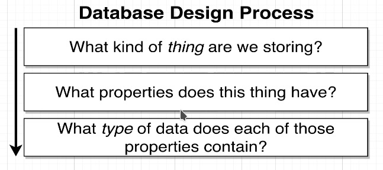
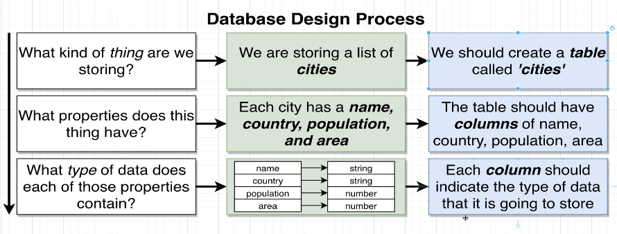
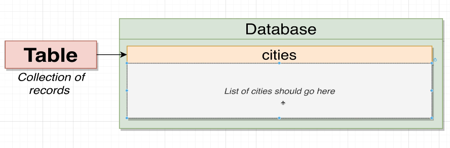
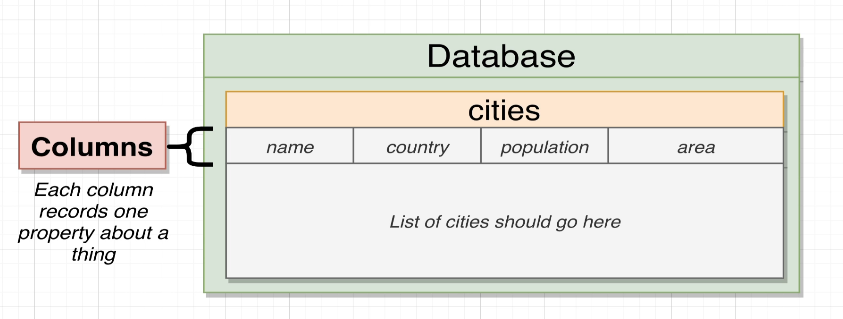
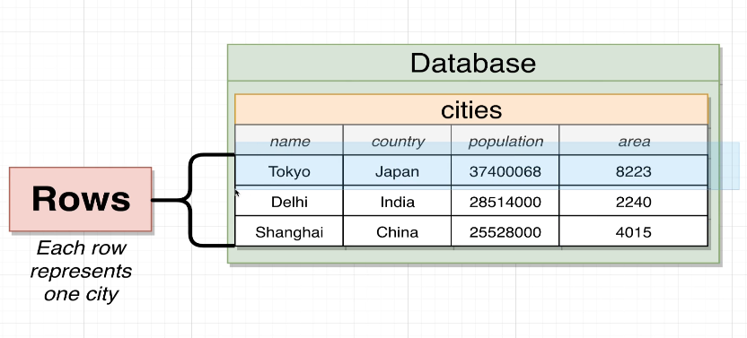

# Database Design

[wiki cities](https://en.wikipedia.org/wiki/List_of_largest_cities)

In the above page, there is a table about cities. We only need the information of city, country, population (urban area), and area (urban area) for each city, and store it in the database.

To design a database, we will go through the following process:

For this case, we got the following result:

Then, we can start to create the database step by step as follows:

1. create a database and table

2. set fields of the table (columns)

3. insert data into the table (rows, records)

