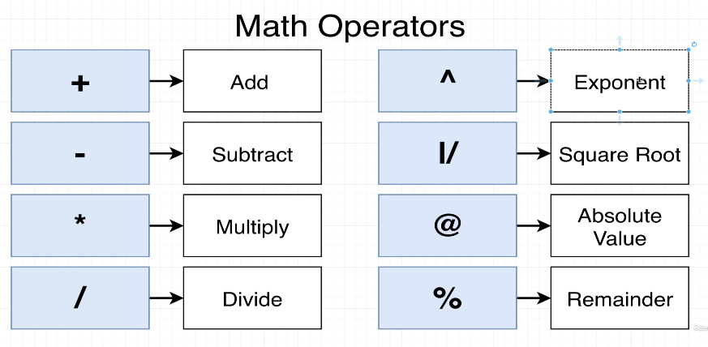

# Calculated column

```sql
SELECT name, population / area FROM cities;
--           ^^^^^^^^^^^^^^^^^ calculated column, there are other operator like +, -, *, /, ^, %, etc


   name    | ?column? 
--           ^^^^^^^^ PostgreSQL computes a calculated column name but doesn't know what to call it
--                    So it names it ?column? by default
-----------+----------
 Tokyo     |     4682
 Delhi     |    12555
 Shanghai  |     5510
 Sao Paulo |     6879
(4 rows)
```

We can also give a name to the calculated column:

```sql
SELECT name, population / area AS density
FROM cities;


   name    | density 
--           ^^^^^^^ calculated column with a name
-----------+---------
 Tokyo     |    4682
 Delhi     |   12555
 Shanghai  |    5510
 Sao Paulo |    6879
(4 rows)
```

## Math operators


