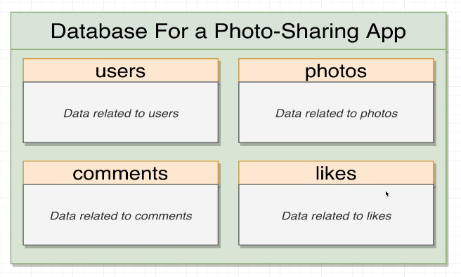
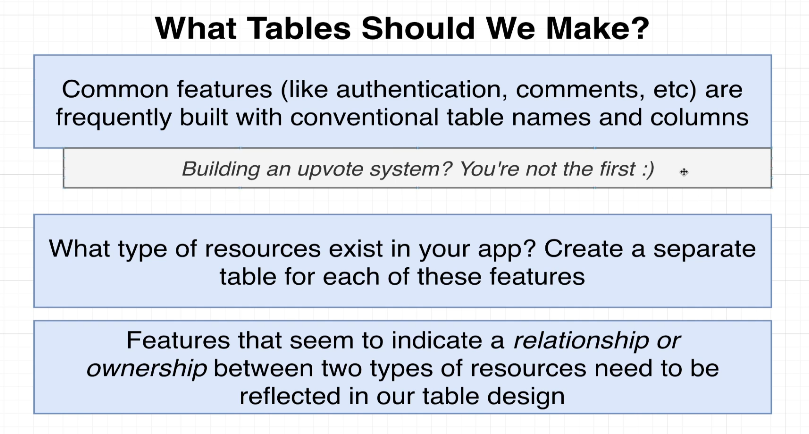
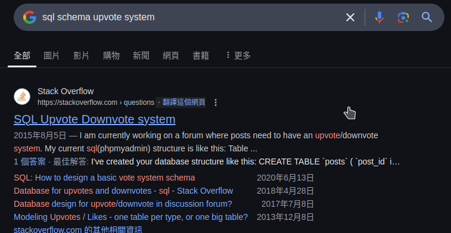
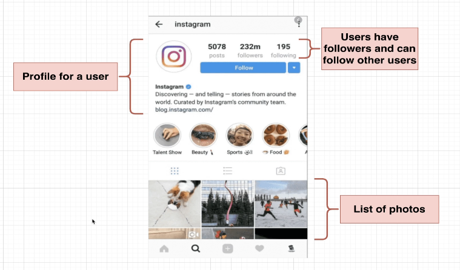
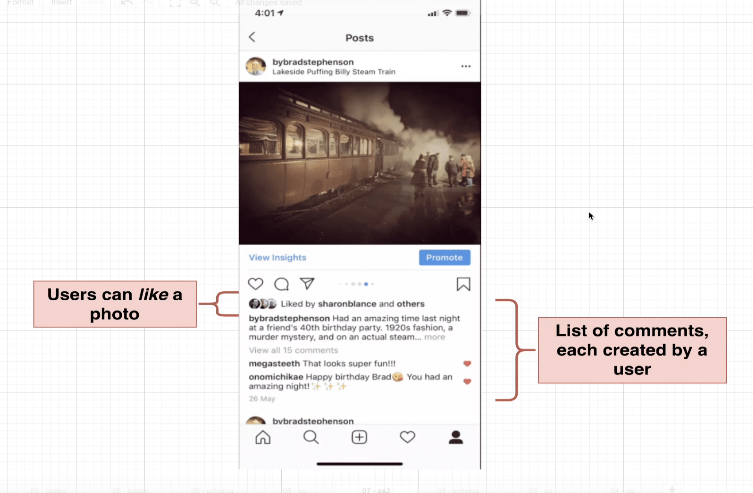
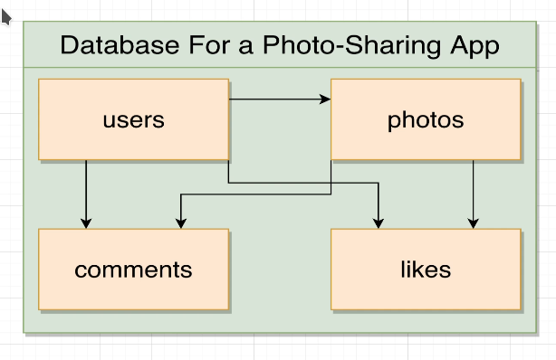

# Design a database

We want to design a database for a photo-sharing app, it probably should have the following tables:

But how these tables come out? We can use the following concepts to guide us:

Simply put, for a common feature, we can search for the way to design tables on the Internet, and then we can come out with the tables for our app.

If we want to design a feature which is not common, we can think what type of `resources` we need to store, and what's relationship between them. Then we can come out with the tables for our app.

we see the resource `user` which has the profile information, and users can follow each other, so users have some relationship between them.

And there is another resource `photo` exists, and users can post photos, so photos have some relationship with users or we can said that user owns the photos.

`photo` can be liked by users and users can comment on photos, so there are two more resources `like` and `comment`. `like` has a relationship with `photo` and `user`, and `comment` has a relationship with `photo` and `user`.

We can draw the tables and their relationships as follows:

The arrows' direction is not important here, each line can means plain relationship or ownership, it depends on the context.

