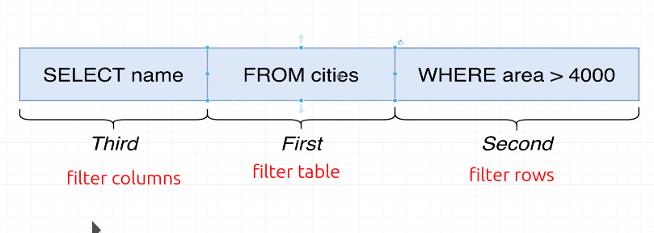

# Filter rows with WHERE

So far, we have been retrieving all rows from the table. However, sometimes we only want a subset of rows. In this case, we can use `WHERE` to filter rows.

```sql
SELECT name, area FROM cities WHERE area > 4000;


   name   | area 
----------+------
 Tokyo    | 8223
 Shanghai | 4015
(2 rows)
```

When we analyze a SQL query, do not assume that the execution order is from front to back. The actual order is as follows:


