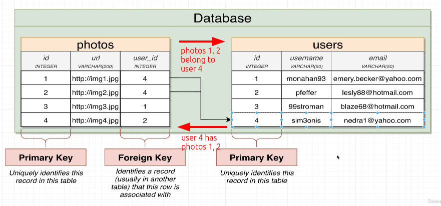

# Primary and foreign key

For implementing one-to-many and many-to-one relationships, we need to add two additional columns to the tables - **primary key** and **foreign key**.

**Primary key**

**Primary key** is a **unique identifier** for each row in a table and it's never changed. Basically, any table should have a primary key column.

**Foreign key**

**Foreign key** is a column in a table that is pointing to the primary key of another table or even to other records in the same table. It's used to relate two records in different tables or the same table.

Be noted that **foreign key** can be null and not unique which is very different from **primary key**.

**Example**

We can use **primary key** and **foreign key** to implement a one-to-many and many-to-one relationship between two tables - `users` and `posts`.

