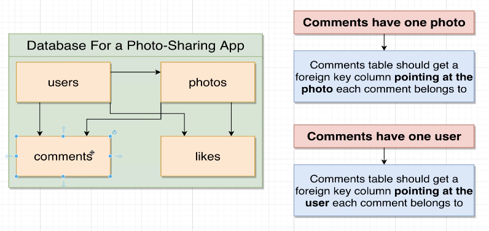
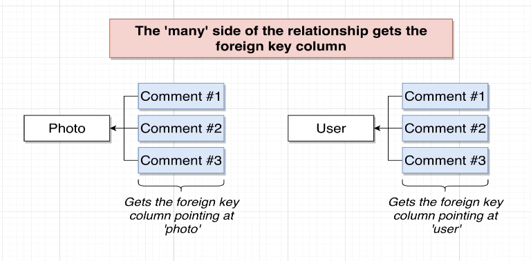
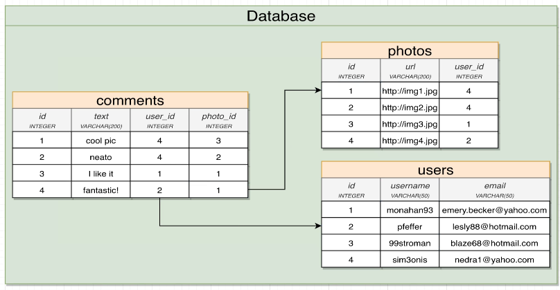
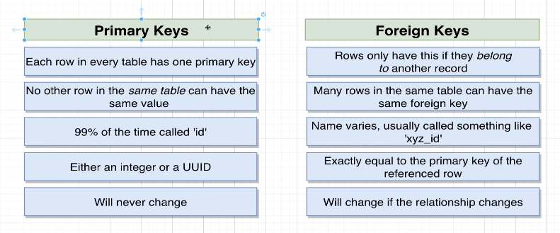

# Understand foreign key

In [[2024-12-30_Primary-and-foreign-key|this topic]], we know that we can use **primary key** and **foreign key** to create relationships between records in different tables.

But the point to establishing a relationship actually lies in deciding which table the foreign key should be in.

Let's check the relationships of the `comments` resource to other resources in the database:

Simply put, the foreign key should be in the table that is on the **many** side of the relationship.

In other words, if a resource is described using "has one" or "belongs to", then the foreign key should be in the table of that resource.

So, the tables should be designed as follows:

Now, we are more familiar with the concept of foreign keys. We can compare it with the primary key again:

