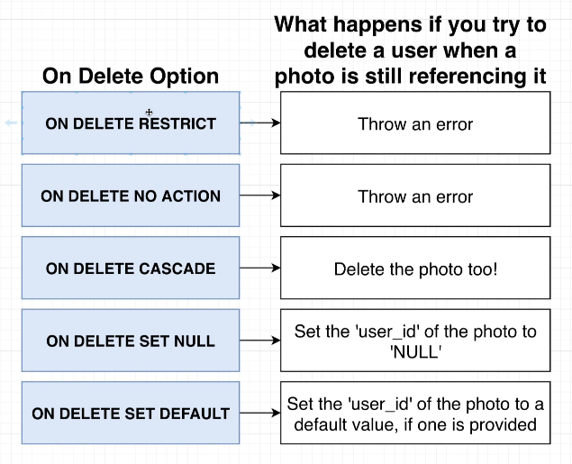

# Constrains Around Deletion

In [[2024-12-31_Foreign-Key-Constrains-Around-Insertion|this topic]], we've learned that databases do some checks of foreign key constraints when inserting data.

But what about deletion? What happens when we try to delete a record that is referenced by a foreign key?

```sql
DELETE FROM users WHERE id = 4;
--                      ^^^^^^ this record is referenced by a foreign key in the photos table

--- OUTPUT ---
psql:/tmp/nvim.mattc/JoHJoj/course-photos-List-2024-12-31-10-02-03:1: ERROR:  update or delete on table "users" violates foreign key constraint "photos_user_id_fkey" on table "photos"
DETAIL:  Key (id)=(4) is still referenced from table "photos".
```

Obviously, the database will prevent the deletion of the record that is still referenced by a foreign key. That's just a default behavior, we can change it by using the `ON DELETE` clause when creating the foreign key, there are options as follows:


