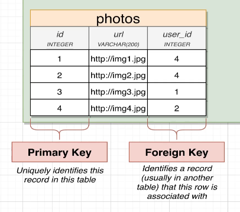

# Generate foreign key column



Let's say we want to create a new column in the `photos` table as above, which is similar to [[2024-12-30_Generate-id-column|create create users table]] but with a foreign key constraint to the `users` table.

```sql
CREATE TABLE photos (
  id SERIAL PRIMARY KEY,
  url VARCHAR(200),
  user_id INTEGER REFERENCES users(id)
  --      ^^^^^^^ ^^^^^^^^^^^^^^^^^^^^ to let PostgreSQL know that this column is a foreign key and points to the `id` column in the `users` table
  --      ^^^^^^^                      PostgreSQL will automatically to enforce data consistency between related tables (in this case, `photos` and `users`)
  --      ^^^^^^^ cannot be SERIAL because foreign key columns need to decide which user to reference
  --              so it cannot be auto-incremented, user needs to provide the value when inserting a new row
);

--- OUTPUT ---
CREATE TABLE
```


```sql
INSERT INTO photos (url, user_id) -- don't need to provide the `id` column but `user_id` should be provided
VALUES
  ('http://img1.jpg', 4),
  --                  ^ need to assign a user_id to the photo record
  ('http://img2.jpg', 4),
  ('http://img3.jpg', 1),
  ('http://img4.jpg', 2);


--- OUTPUT ---
INSERT 0 4
```

If you try to insert a photo record point to non-existing user_id, you will get an error.

```sql
INSERT INTO photos (url, user_id)
VALUES
  ('http://img9.jpg', 9);
  --                  ^ this user_id does not exist in the `users` table

--- OUTPUT ---
psql:/tmp/nvim.mattc/OfzIk9/course-query-2024-12-31-00-11-57:3: ERROR:  insert or update on table "photos" violates foreign key constraint "photos_user_id_fkey"
DETAIL:  Key (user_id)=(9) is not present in table "users".

```

That's because we've tell PostgreSQL that the `user_id` column in the `photos` table should reference the `id` column in the `users` table. So PostgreSQL will enforce the data consistency between the two tables.

```sql
