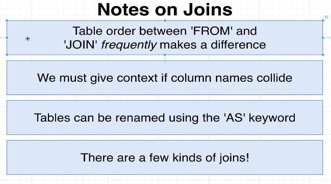

# Alternate Forms of Syntax

In this topic, we will discuss some notes about `JOIN` as follows:




**First Note: Table order between `JOIN` and `FROM` makes difference**`

Accurately speaking, only in certain scenarios, the order of tables will affect the result of the query.

```sql
SELECT
  contents, url
FROM
  comments
JOIN
  photos ON photos.id = comments.photo_id;
```

```sql
SELECT
  contents, url
FROM
  photos
--^^^^^^
JOIN
  comments ON photos.id = comments.photo_id;
--^^^^^^^^
-- we flip the order of the tables, but the result is the same in this case

```
In the example above, the order of tables in `JOIN` and `FROM` can be swapped, but in other types of joins, such swapping may lead to different results. We will introduce different types of joins in future topics and discuss this issue.


**Second Note: We must give context if column names collide**


When we join two tables, we may find that there is a duplicate column name. If we need to select these columns in the query, we must be more specific, otherwise an error will occur.

```sql
SELECT
  id
FROM
  comments
JOIN
  photos ON photos.id = comments.photo_id;


--- OUTPUT ---
psql:/tmp/nvim.mattc/wJmEwp/course-query-2025-01-01-12-04-58:6: ERROR:  column reference "id" is ambiguous
LINE 2:   id
          ^
```

So, we need to be more specific:

```sql
SELECT
  comments.id
FROM
  comments
JOIN
  photos ON photos.id = comments.photo_id;


--- OUTPUT ---
 id  
-----
   1
   2
   3
   4
...

```

We can also use aliases to make the query more concise:

```sql
SELECT
  c.id
--^ use alias 'c' instead of 'comments', or the error will occur
FROM
  comments AS c
--         ^^^^ alias table name as 'c', this clause is the first step so that we MUST use 'c' in the following clauses
--              AS can be omitted in this case, but it is a good practice to use it for better readability
JOIN
  photos ON photos.id = c.photo_id;
--                      ^ use 'c' instead of 'comments', or the error will occur


--- OUTPUT ---
 id  
-----
   1
   2
   3
   4
...

```

If we use original table names after aliasing, an error will occur:

```sql
SELECT
  comments.id
--^^^^^^^^ use original table name 'comments' instead of alias 'c', so an error will occur
FROM
  comments AS c
JOIN
  photos ON photos.id = c.photo_id;


--- OUTPUT ---
psql:/tmp/nvim.mattc/wJmEwp/course-query-2025-01-01-12-04-58:6: ERROR:  invalid reference to FROM-clause entry for table "comments"
LINE 2:   comments.id
          ^
HINT:  Perhaps you meant to reference the table alias "c".

