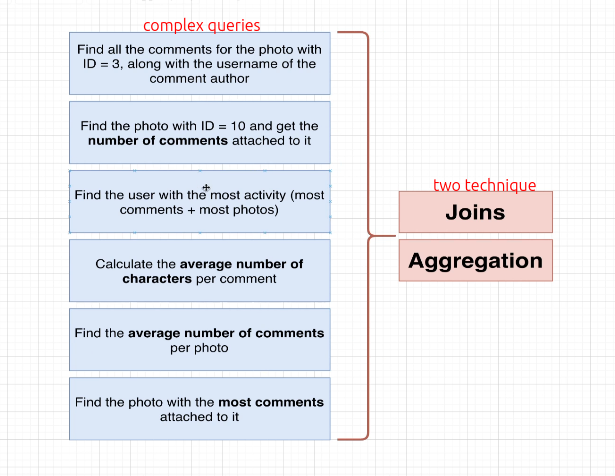
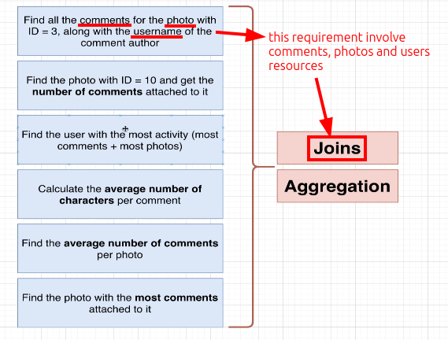
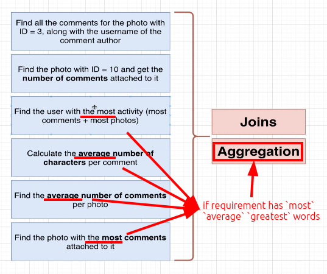

# Complex query and two important technique

In [[2025-01-01_Create-comments-table-and-recreate-users-and-photos-tables|this topic]], we created three related tables: `users`, `photos`, and `comments` and inserted some data into them. Then, we can use these tables to practice some complex queries.

When queries are very complex, two important techniques are **JOIN** and **AGGREGATION**.

When our needs involve multiple resources, we may need to use `JOIN` to group columns from different tables to a single row.

When we need to summarize a result from multiple rows, we may need to use `AGGREGATION`.

