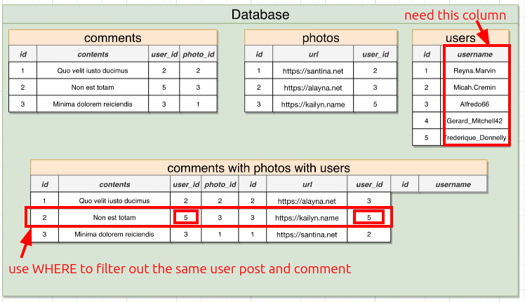

# Three way joins

In [[2025-01-01_Where-with-join|this topic]], we use `WHERE` to filter on imaginary table. Now, we want one more column `username`, which is in `users` table.



Because `username` is in `users` table, we need to use `JOIN` again in the query:

```sql
SELECT url, contents, username
FROM comments
JOIN photos ON photos.id = comments.photo_id -- First inner join, we've done in the last topic
JOIN users ON users.id = comments.user_id AND users.id = photos.user_id; -- Second inner join, new join to get username
                                                                        -- It need to match user id with both photos and comments so it should be more complex
                                                                        
-- WHERE comments.user_id = photos.user_id;  -- because the second inner joins need to match user id in both tables, so only comments.user_id = photos.user_id can be used
                                             -- so we don't need to use WHERE clause here

```

Because the second inner JOIN automatically forces only rows where comments.user_id = photos.user_id to be selected, so there is no need to filter again with WHERE.
