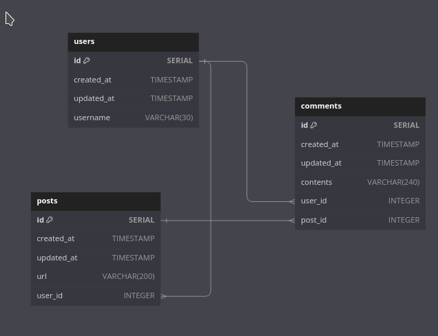

# Rebuilding Some Schema

We want to create schema structure for instegram like application with [dbdiagram.io](https://dbdiagram.io/)

```js
Table users {
  id SERIAL [pk, increment]
  created_at TIMESTAMP
  updated_at TIMESTAMP
  username VARCHAR(30)
}

Table posts {
  id SERIAL [pk, increment]
  created_at TIMESTAMP
  updated_at TIMESTAMP
  url VARCHAR(200)
  user_id INTEGER [ref: > users.id]
}

Table comments {
  id SERIAL [pk, increment]
  created_at TIMESTAMP
  updated_at TIMESTAMP
  contents VARCHAR(240)
  user_id INTEGER [ref: > users.id]
  post_id INTEGER [ref: > posts.id]
}
```


