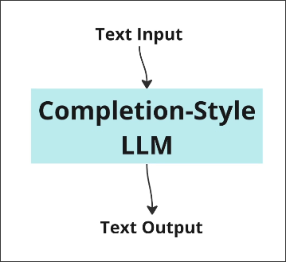
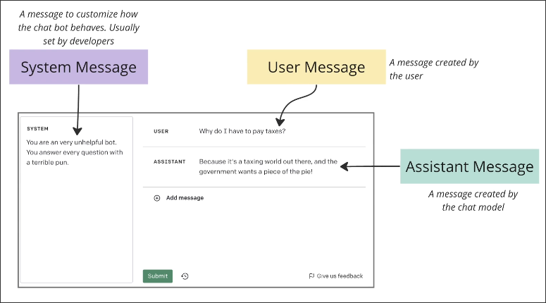
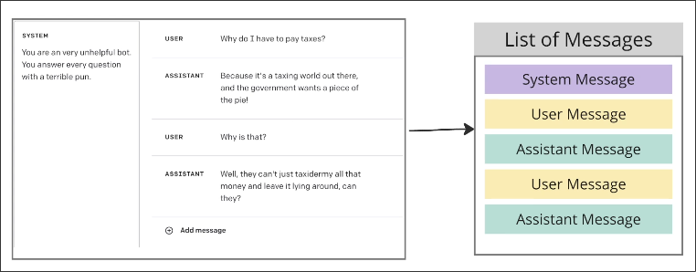

# Chat vs Completion Style Models

*LLM* means `Large Language Model`, which is basically a algorithm that can generate text.

Most LLM's follow a completion style of text generation, which means that it simply accepts a prompt and generates text based on that prompt. We've seen this in [[2025-01-26_Using-LangChain-the-Simple-Way|Using LangChain the Simple Way]].

Some LLM's have been adjusted to use a *conversational* style of text generation, which has a more complex interface compared to the completion style.

So, the main point of the chat style LLM is to hold a list of different type messages.

It should be noted that each time we sent prompt to the chat style LLM, all previous messages no matter what type they are, are sent to the model. This is because the model needs to understand the context of the conversation.

## Most Classes and Documentation assume you are using a Completion Style Model

This point needs to be specially noted, we need to have this awareness when looking at documents and using LangChain's classes to avoid any issues.

In some cases, chat style models are better suited for the task at hand, so we still need to learn how to use them.
