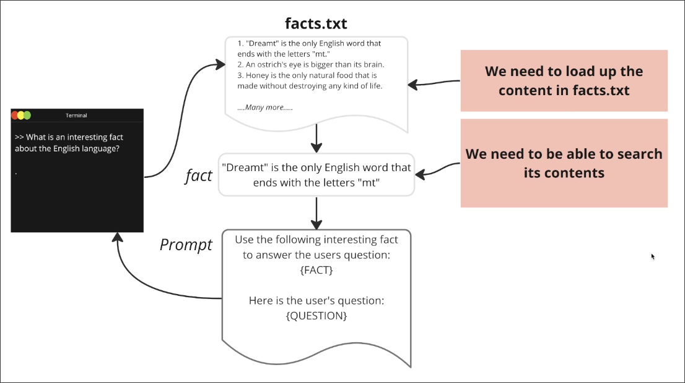

# Project Overview

The file may not be a .txt, it could also be in other formats such as .pdf, .docx, etc.

How can we retrieve and include facts related to user questions from the file in the prompt? This is the main question that this section explores.

