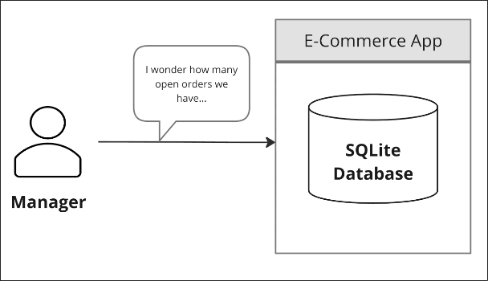
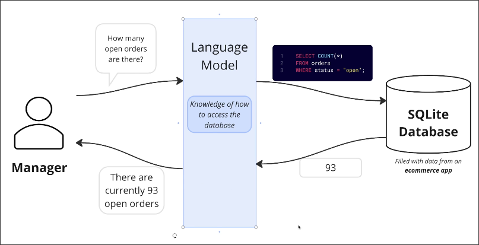

# App Overview

Assuming we work in an E-commerce company, all the products and order data of the company are stored in a SQLite database. There are many colleagues in the company who do not understand SQL, and they need to query the data in the database through a simple interface.

And we are the engineers responsible for developing this interface, but every requirement requires us to manually write a new SQL query and write the corresponding interface, the workload is endless and tedious.

So we want to create a app that can use an AI model to automatically generate SQL queries based on the natural language requirements of the user, and then return the results to the user in natural language.

This app is actually very simple, the flowchart above is even more complex than the actual app. In the following topics, we will implement this app step by step.
