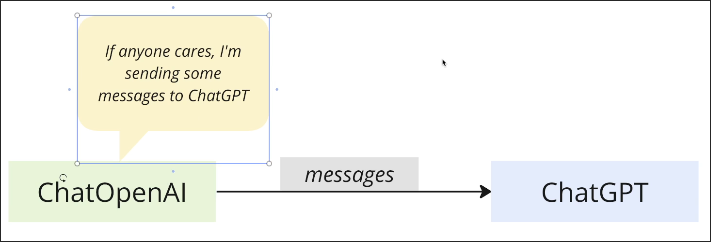
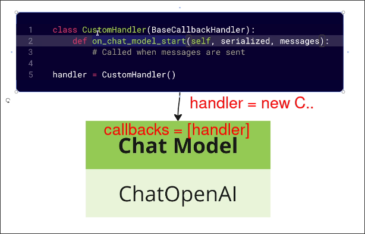
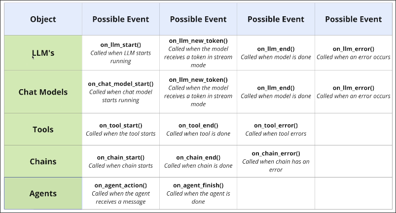

# Understanding Callbacks

What should we do if we want to perform some operations before, after, or in case of failure when sending a message to an AI model in a certain object?

In the old version of LangChain, the chat model, llm, tool, and agent classes all have a parameter called `callbacks`. We can create a special handler class with some specific method names defined inside tahat will trigger certain behaviors at specific times.

For different classes, there are different specific methods we can define in the callback handler class as shown in the image bellow.

