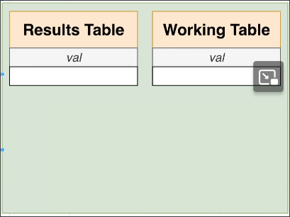
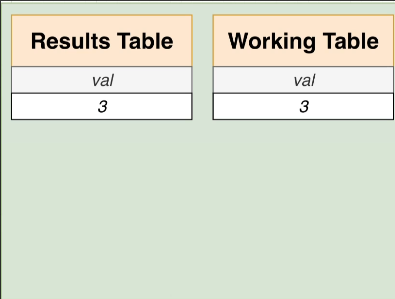
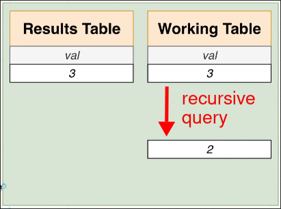

# Recursive CTEs Step by Step

[[2025-02-17_Recursive-CTEs|Last topic]], we've given an example of a recursive CTE at the end but not explained it in detail. Now we will explain it step by step.

```sql
WITH RECURSIVE coundown(val) AS (
  -- query above the UNION ALL is called initial, non-recursive query
  SELECT 3 AS val
  UNION ALL
  -- query below the UNION ALL is called recursive query
  SELECT val - 1 FROM coundown WHERE val > 1 
)

SELECT * FROM coundown;
```

## Step 1: Define the results and working tables under the hood

Both table takes the parameter `val` as an column. It also means that you can put multiple parameters inside the parentheses.




## Step 2: Run initial query and put the results to the both tables

The initial query is `SELECT 3 AS val`. It will put the result `3` to the both tables.



## Step 3: Run recursive query and `countdown` refers to the working table in this query

Run the recursive query:
```sql
SELECT val - 1 FROM coundown WHERE val > 1 
--                  ^^^^^^^^ refers to the working table
```



## Step 4: If step 3 returns any rows, APPEND the results to the results table and OVERWRITE the working table with the results, then go back to step 3


## Step 5: If step 3 returns no rows, stop the recursion and return the results table as `countdown` table for the rest of the query


So if we use the `countdown` table in a query outside of CTEs, we are actually using the final result of the results table.

```sql
SELECT * FROM coundown;
--            ^^^^^^^^ refers to the results table with the final result

```
