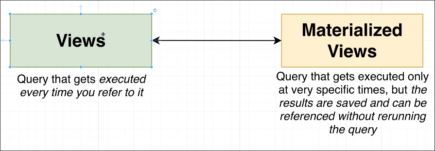
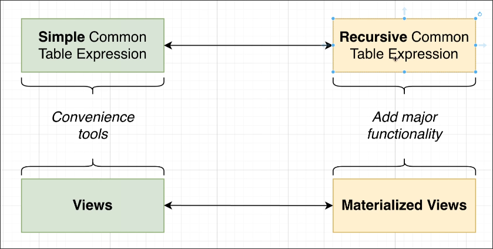

# Materialized Views

## Views vs Materialized Views

So for some larger queries, we can use materialized views to pre-calculate and save the results in advance, so that the next time we query, we don't have to recalculate it, which can improve query efficiency.

## Parrallelism

Views and Simple CTE are used to simplify the query itself and do not provide any specific functionality, but Materialized Views and Recursive CTE can provide some key functionalities.

So the diagram above explains that views are similar to simple CTEs, while materialized views are similar to recursive CTEs. This kind of relationship exists.

