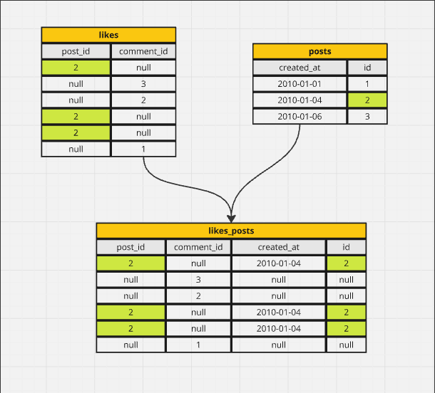
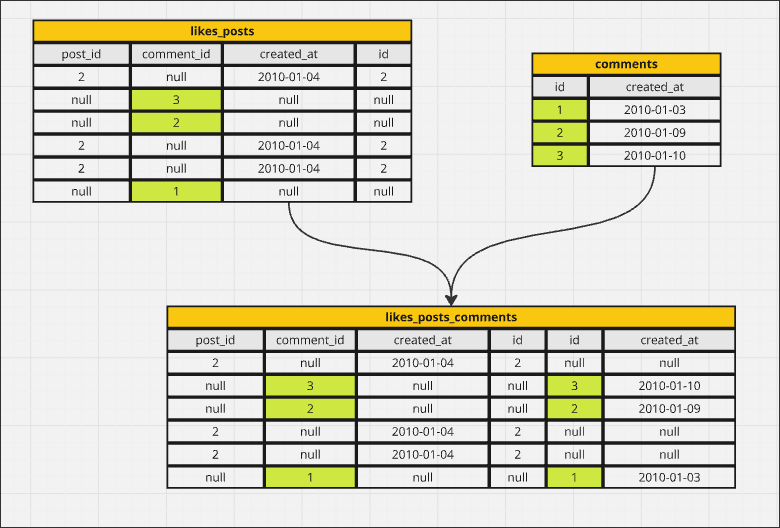

# Reminder on Left Joins

In order to solve the problem of the previous topic, we must use LEFT JOIN, because in the table `likes`, the `post_id` and `comment_id` in each row will definitely have one as null, causing the result to be an empty table when using a regular inner JOIN.

Because we have always used inner JOIN, so below we will use the example from the previous topic to perform a three way join using LEFT JOIN, and break down the operation step by step with graphical explanations:

1. LEFT JOIN `posts` to `likes`:

The difference between LEFT JOIN and inner JOIN is that the left table will retain all rows, and if there are no matching rows in the right table, NULL will be used to fill in all missing columns.

2. LEFT JOIN `comments` to the result of the previous step:

Then, we finally got the result of the three way join(LEFT JOIN)

