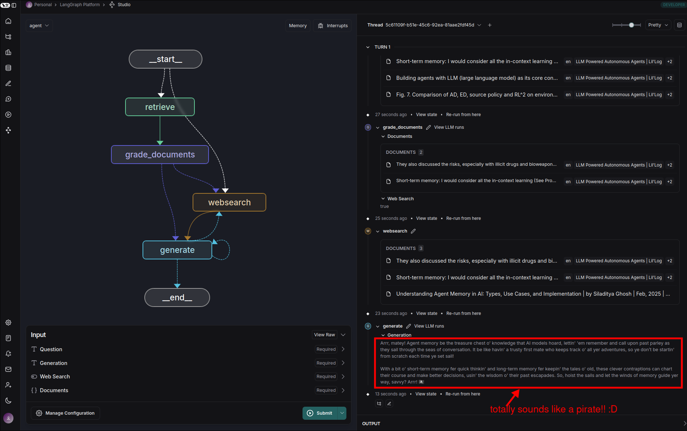

# Change online code

In this topic, we will directly modify project codes and test if it directly affects LangGraph Studio.


## Requirements

We want the final AI to answer questions like a pirate.


## Check the LangSmith


We can continue to expand this chain from the `StrOutputParser` above, so that it can directly output the results we want.


## Expand the chain of node `generate`

File: /home/matt/Projects/langgraph-course/graph/chains/generation.py
```python
from langchain import hub
from langchain_core.output_parsers import StrOutputParser
from langchain_openai import ChatOpenAI
from langchain_core.prompts import PromptTemplate


llm = ChatOpenAI(model="gpt-4o-mini", temperature=0)
prompt = hub.pull("rlm/rag-prompt")
# You are an assistant for question-answering tasks. Use the following pieces of retrieved context to answer the question. If you don't know the answer, just say that you don't know. Use three sentences maximum and keep the answer concise.
# Question: {question} 
# Context: {context} 
# Answer:

# generation_chain = prompt | llm | StrOutputParser()

# Create a new prompt template that accepts the output of above StrOutputParser
pirate_prompt_template = PromptTemplate.from_template(
    template="take {output} and answer like pirate"
    #               ^^^^^^ because StrOutputParser output a `output` field
)

generation_chain = (
    prompt
    | llm
    | StrOutputParser()
    # extend the chain to use the new prompt template and answer like a pirate
    | pirate_prompt_template
    | llm
    | StrOutputParser()
)

```

## Test the code with LangGraph Studio

Let's run the graph with new thread on the LangGraph Studio to check if the updated code works.



It can be seen that the final answer of the graph is completely in the style of a pirate, proving that modifying the code directly can directly affect the operation of LangGraph Studio. This is very helpful for us in developing new features.

